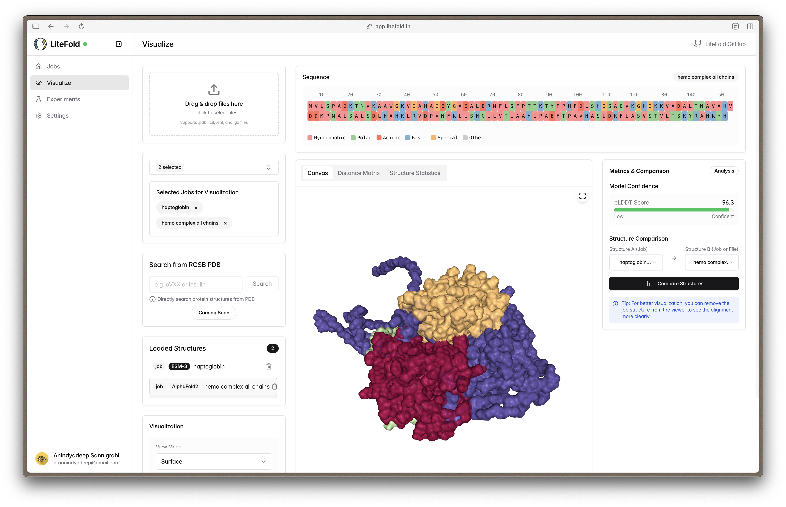

# LiteFold: Protein Structure Prediction Made Accessible

LiteFold makes protein structure prediction accessible without the usual GPU setup headaches. It's a simple server that runs state-of-the-art folding models for researchers and students.



## Overview

The release of models like AlphaFold has transformed computational structural biology, enabling unprecedented accuracy in protein structure prediction. However, there remains a significant accessibility gap between these powerful tools and the broader scientific community.

LiteFold bridges this gap by providing:

1. A lightweight, GPU-powered inference server for protein structure prediction
2. Support for state-of-the-art models starting with ESMFold
3. Simple self-hosting capabilities for researchers who need local control

## Self-Hosting Guide

### Prerequisites

- NVIDIA GPU with CUDA support
- Docker and Docker Compose
- At least 12GB of GPU memory (for ESMFold 3B model)
- 20GB+ disk space for models and results

### Quick Start with Docker

The fastest way to get LiteFold running is with Docker:

```bash
# Clone the repository
git clone https://github.com/Anindyadeep/litefold
cd litefold

# Start the container (will download model weights on first run)
docker compose up -d
```

The server will be available at http://localhost:8000

### Manual Setup

If you prefer to run without Docker:

1. Install dependencies:

   ```bash
   pip install -r requirements.txt
   ```

2. Start the server:
   ```bash
   python selfhosted.py
   ```

### Configuration Options

The server can be configured using environment variables:

| Variable                  | Description                | Default                |
| ------------------------- | -------------------------- | ---------------------- |
| `CUDA_DEVICE`             | GPU device to use          | `cuda:0`               |
| `SQLALCHEMY_DATABASE_URL` | Database connection string | `sqlite:///db/jobs.db` |

## Usage

Once your server is running, you can:

1. Submit protein structure prediction jobs via REST API
2. Monitor job status and retrieve results
3. Visualize predicted structures (if using the frontend)

### API Endpoints

- `/predict` - Submit a new prediction job
- `/status/{job_id}` - Check job status
- `/successful-jobs/{user_id}` - List successful jobs for a user
- `/health` - Check server health

### Example API Usage

Submit a prediction job:

```python
import requests
import json

url = "http://localhost:8000/predict"
payload = {
    "job_id": "example-job-123",
    "job_name": "Hemoglobin Alpha",
    "model": "esmfold_3B_v1",
    "sequence": "MVHLTPEEKSAVTALWGKVNVDEVGGEALGRLLVVYPWTQRFFESFGDLSTPDAVMGNPKVKAHGKKVLGAFSDGLAHLDNLKGTFATLSELHCDKLHVDPENFRLLGNVLVCVLAHHFGKEFTPPVQAAYQKVVAGVANALAHKYH",
    "user_id": "user-123"
}
response = requests.post(url, json=payload)
print(response.json())
```

Check job status:

```python
job_id = "example-job-123"
status_url = f"http://localhost:8000/status/{job_id}"
response = requests.get(status_url)
print(response.json())
```

## Frontend Integration

While this repository contains the backend server, you can connect it to the LiteFold frontend for a complete experience. If you're using the managed LiteFold service, you can point it to your self-hosted backend by going to Settings → Server Configuration.

## Why LiteFold?

Traditional protein structure prediction pipelines come with significant barriers:

- Complex dependencies and environment setup
- High GPU requirements
- Fragmented visualization and analysis tools

LiteFold simplifies this process with a streamlined, modular approach that separates inference from visualization, allowing researchers to focus on the science rather than infrastructure maintenance.

## Feature Roadmap

- [x] ESMFold model support
- [ ] OpenFold integration
- [ ] RNA structure prediction
- [ ] Protein-ligand docking
- [ ] Protein-protein interaction modeling

## Contributing

This project is in active development, and contributions are welcome! Whether you're a structural biologist, ML researcher, or software engineer, there are many ways to get involved:

1. File issues for bugs or feature requests
2. Submit pull requests for improvements
3. Share scientific or technical feedback

## License

This project is licensed under [MIT License](LICENSE).

## Acknowledgments

LiteFold builds upon the remarkable work of the open-source structural biology community, particularly:

- Meta AI's ESM team for ESMFold
- The AlQuraishi Lab for OpenFold
- The broader computational structural biology community

---

For more information about the project vision and educational resources, visit [semanticsearch.in/litefold](https://www.semanticsearch.in/litefold).
